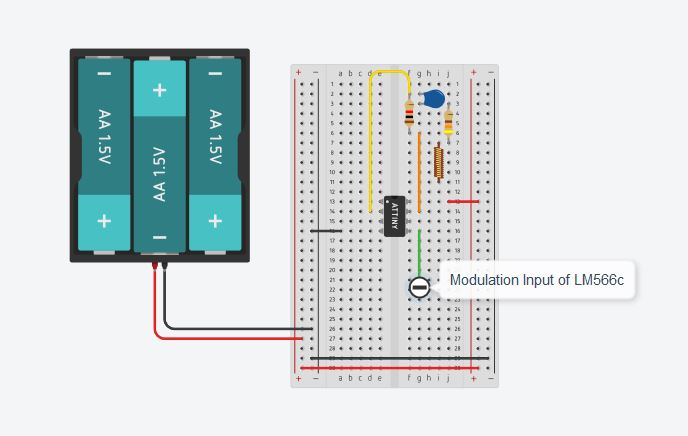
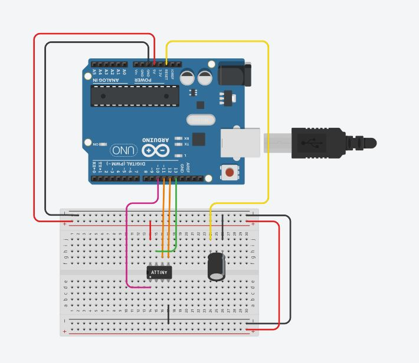

# Sensors and Microsystems Technology
## Project : Design of a sensor to measure COVID-19 in air and saliva
### Pigi Lozou
### September 2020


An ATTiny85 microprocessor is used to drive the ramp or the steps. The computing power of ATTiny85 is enough for the function we need.




The ATTiny85 is programmed using Arduino: ``` attiny85_and_arduino_wiring_for_attiny85_programming1.ino ```




